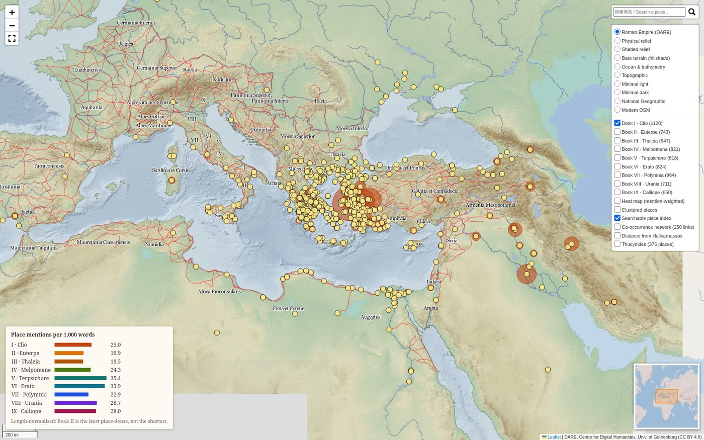

# Herodotus Place Map

An interactive map of every place named in Herodotus's *Histories*, built by
matching the text against the [Pleiades](https://pleiades.stoa.org/) gazetteer
of the ancient world. Optionally overlays Thucydides for comparison.

  

**[▶ Open the live map](https://Opiowo.github.io/herodotus-map/herodotus_map.html)**

[](https://Opiowo.github.io/herodotus-map/herodotus_map.html)

*Book I plotted on the Digital Atlas of the Roman Empire. Circle size tracks
how often a place is named; the legend gives length-normalised density per book.*

## What it does

1. Downloads the Macaulay translation of Herodotus from Project Gutenberg
   (public domain, 1890) and the Pleiades gazetteer dumps (CC-BY).
2. Matches capitalised tokens against the gazetteer, folding Greek/Latin
   transliteration variants together (`Miletus` ~ `Miletos` ~ `Mīlētos`) and
   mapping peoples onto their land (`Lydians` → Lydia).
3. Writes an interactive Folium map plus a CSV of every mention.

**554 places · 7,298 mentions** across the nine books.

## Map layers

| Layer | What it shows |
|---|---|
| Books I–IX | One colour per book, sized by mention count |
| Heat map | Mention-weighted density — the centre of gravity sits on the eastern Aegean |
| Clustered places | Tames the Aegean pile-up |
| Co-occurrence network | Places named in the same chapter, weighted by how often |
| Distance from Halikarnassos | 250 km rings from Herodotus's birthplace |
| Thucydides | Comparison layer (`--thucydides`) |

Ten key-free basemaps, including the Digital Atlas of the Roman Empire,
bare hillshade terrain, and sea bathymetry.

Search accepts English or Chinese: `Thebes`, `底比斯`, `Thebai` all find the
same place.

## Two findings worth noting

**Raw counts mislead about the Egyptian digression.** Book II looks sparse
next to Book VII (743 mentions against 964), and Book VII looks like the
place-dense one. Normalised by length the ranking inverts: Book VII drops to
22.9 mentions per 1,000 words while Book V reaches 35.4, and Book II sits near
the bottom at 19.9. Books II and III spend their words on customs, geography
and the Nile rather than on naming places.

**Herodotus and Thucydides share a centre but not an edge.** Median distance
from Halikarnassos is nearly identical (452 km vs 470 km). The difference is
entirely in the tail: Herodotus reaches 5,321 km, Thucydides 2,530 km.

## Usage

```bash
pip install -r requirements.txt

python herodotus_map.py                    # build the map
python herodotus_map.py --thucydides       # add the comparison layer
python herodotus_map.py --top 30           # print the 30 most-named places
```

Output lands in `output/`: `herodotus_map.html` and `herodotus_mentions.csv`.
Downloads are cached in `data/`, so only the first run pays for them.

### Viewing the map

A pre-built copy sits at the repository root as `herodotus_map.html` (2.6 MB —
too large for GitHub's file preview, so open it via Pages or download it).

To publish it: **Settings → Pages → Source: Deploy from a branch → main / (root)
→ Save**. After a minute it is live at
`https://Opiowo.github.io/herodotus-map/herodotus_map.html`.

Rebuilding the map overwrites `output/herodotus_map.html`; copy it to the root
to update the published version.

### Chinese place names

`data/zh_names.csv` maps Pleiades ids to Chinese names. To extend it from an
index you have legitimate access to:

```bash
python parse_index_shots.py data/index_shots/     # OCR + parse (PaddleOCR)
python resolve_zh_ids.py --merge --overwrite      # attach Pleiades ids
python fetch_wikidata_zh.py --merge               # CC0 fallback names
```

## Accuracy

Disambiguation is the hard part, and several fixes came from cross-checking
against a bilingual index:

- **Thebes** matched the Troad's Thebe (in Turkey) rather than Boeotian Thebes,
  because `norm()` lacked an `-es` → `-ai` rule and Pleiades' `Thebai/Thebae`
  title welded into one nonsense key. Both fixed; 102 mentions moved to Thiva.
- **Aegina** scored zero — Macaulay spells it *Egina*, which never met the
  gazetteer's `aigina`. Now 124 mentions, the 8th most-named place.
- Homonyms the centroid heuristic gets wrong (Babylon-in-Cairo, Cyprus-in-Judaea,
  Syria-in-the-Ionian-islands) are pinned to verified Pleiades ids in `PINNED`.

Top-25 places were checked against independent coordinates: 22 agree within
120 km; the two outliers are region centroids, which are approximate by nature.

## Data sources and licensing

| Source | Licence |
|---|---|
| Herodotus, tr. Macaulay (Gutenberg #2707, #2456) | Public domain |
| Thucydides, tr. Crawley (Gutenberg #7142) | Public domain |
| [Pleiades](https://pleiades.stoa.org/) gazetteer | CC-BY |
| [DARE](https://dh.gu.se/dare/) basemap tiles | CC-BY 4.0 |
| Wikidata labels | CC0 |

Chinese place names in `data/zh_names.csv` are factual id-to-name
correspondences compiled with reference to 徐松岩's translations. The book's
text, notes and index prose are **not** included in this repository.

## Licence

Code: MIT. Derived data files follow their upstream licences above.
